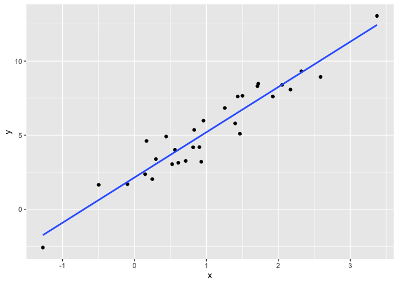

Simulation
================
Amanda Howarth
11/10/2019

``` r
set.seed(1)

# sample size, intercept, slope 
sim_regression = function(n, beta0 = 2, beta1 = 3) {
  
  sim_data = tibble(
    x = rnorm(n, mean = 1, sd = 1),
    y = beta0 + beta1 * x + rnorm(n, 0, 1)
  )
  
  ls_fit = lm(y ~ x, data = sim_data)
  
  tibble(
    beta0_hat = coef(ls_fit)[1],
    beta1_hat = coef(ls_fit)[2]
  )
}
```

\#repeated sampling

``` r
sim_regression(n=30)
```

    ## # A tibble: 1 x 2
    ##   beta0_hat beta1_hat
    ##       <dbl>     <dbl>
    ## 1      2.09      3.04

with linear regression we know something about the distribution of the
estimates

## rerun using a for loop

``` r
output = vector("list", length = 5000)

for (i in 1:5000) {
  
  output[[i]] = sim_regression(n=30)
}

#checking that your linear regression model follows the distribution that it should be following 
bind_rows(output) %>%
  ggplot(aes(x = beta0_hat)) + geom_density()
```

<!-- -->

## rerun simulation using “purrr”

``` r
output = rerun(5000, sim_regression(n = 30)) %>%
  bind_rows
```

5,000 times u have generated samples wtih sample size =30 and there is a
beta0 and beta1 that u got

``` r
output %>% 
  ggplot(aes(x = beta0_hat, y = beta1_hat)) + 
  geom_point()
```

<!-- --> what is
going on here? the beta0 and beta1 are correlated?

``` r
 sim_data = tibble(
    x = rnorm(30, mean = 1, sd = 1),
    y = 2 + 3 * x + rnorm(30, 0, 1)
  )

sim_data %>% ggplot(aes(x = x, y = y)) + geom_point() +
  stat_smooth(method = "lm", se = FALSE)
```

<!-- -->

``` r
output %>% 
  pivot_longer(
    beta0_hat:beta1_hat,
    names_to = "parameter", 
    values_to = "estimate") %>% 
  group_by(parameter) %>% 
  summarize(emp_mean = mean(estimate),
            emp_var = var(estimate)) %>% 
  knitr::kable(digits = 3)
```

| parameter  | emp\_mean | emp\_var |
| :--------- | --------: | -------: |
| beta0\_hat |     2.005 |    0.072 |
| beta1\_hat |     2.995 |    0.037 |

## try another sample size

may want to increase sample size bc mean may stay the same but variance
may change with large sample size

try to run a new simulation for each sample size below run code each
time but vary sample size each time -first time it will pull out 30,
second time 60, third time 120, etc.

``` r
n_list = list("n_30"  = 30, 
              "n_60"  = 60, 
              "n_120" = 120, 
              "n_240" = 240)
output = vector("list", length = 4)

for (i in 1:4) {
  output[[i]] = rerun(100, sim_regression(n_list[[i]])) %>% 
    bind_rows
}
```

``` r
sim_results = 
  tibble(sample_size = c(30, 60, 120, 240)) %>% 
  mutate(
    output_list = map(.x = sample_size, ~rerun(1000, sim_regression(n = .x))),
    output_df = map(output_list, bind_rows))%>%
  select(-output_list) %>% 
  unnest(output_df)
```

``` r
sim_results %>% 
  mutate(
    sample_size = str_c("n = ", sample_size),
    sample_size = fct_inorder(sample_size)) %>% 
  ggplot(aes(x = sample_size, y = beta1_hat, fill = sample_size)) + 
  geom_violin()
```

<!-- -->
